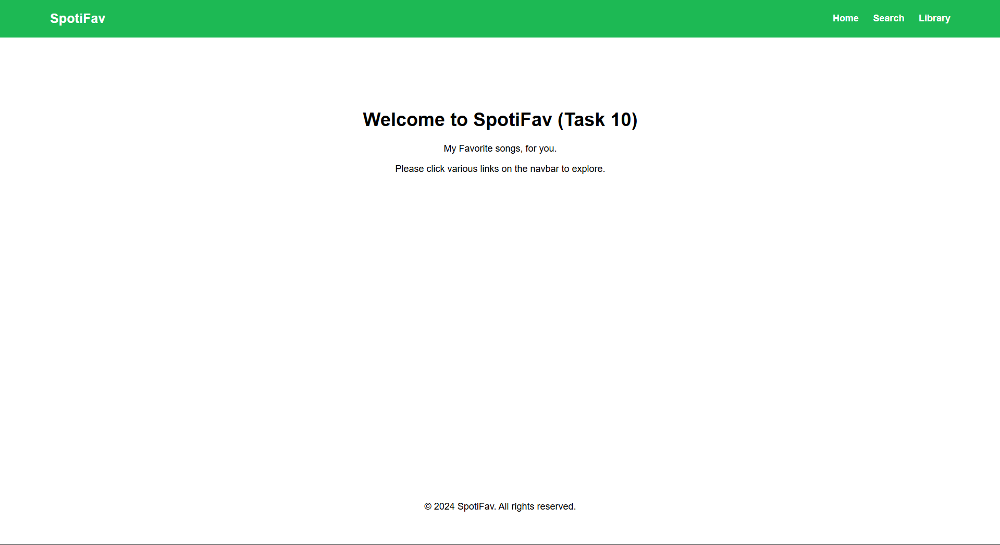
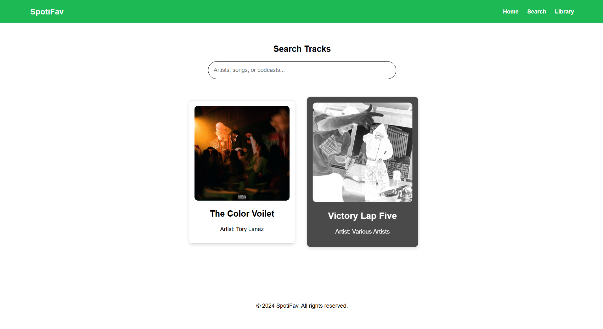
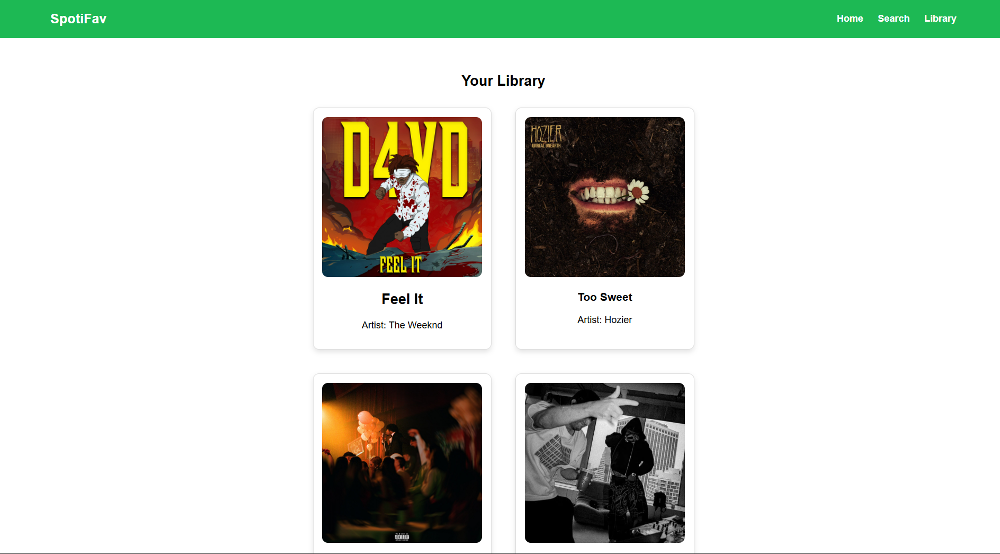

# Task 3

### Objective

- A fully functional, multi-section website that simulates the experience of navigating between different pages only with pure css

### 1. Responsive Layout (Media Query)

- Defined a media query that ensures layout changes when smaller screen (max width 600px) are viewing the content.
- Grid cols reduces from 3 in desktop screens(>1000px) to 2 on tablets screens(600-1000px) and then 1 on mobile screen(<600px)

### 2. Grid

- arrange elements in a predefined grid layout
- cols are defined in css file
- gap property is used to define the spacing between elements withing a grid layout
- place-items and justify-items are used to align items horizontally and vertically withing a section of grid.

### 3. Flexbox

- Used Flexbox layout inside every grid item to align content inside each element of grid vertially and horizontally.
- Ensure equal spacing between elements and the border within the elements of the grid.

### 4. :target pseudo-clss

- Used _:target_ pseudo-class to conditionally pick the section with a given id using url
- conditionlly show pages like _library_ using the url _/task10.html/#library_ by only rendering section with _id = library_
- Used _#home:has(~ .page:target)_ so that there is a page present other than home page, is in focus and rendered then the home page is set to _display:none_. This prevernts stacking of home page and any other page that is being conditionally rendered

### 5. Other Properties

- Used Z-Index with relative and absolute positioning to place the image on top of the header.
- used box shadow to give slight depth effect to the images and card
- Maintained the same green purple theme, green for desktop screens and purple for mobile devices

### 3. Output

**Desktop View**

