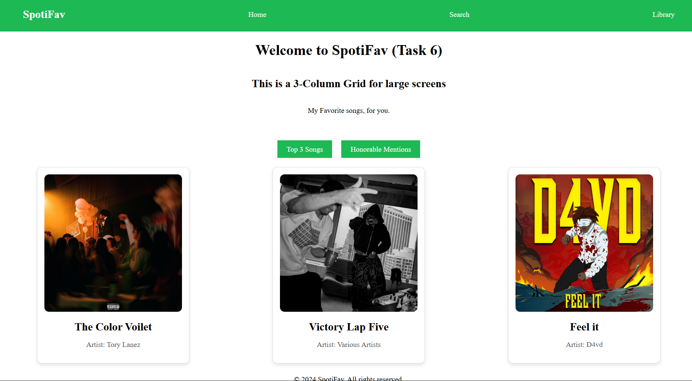
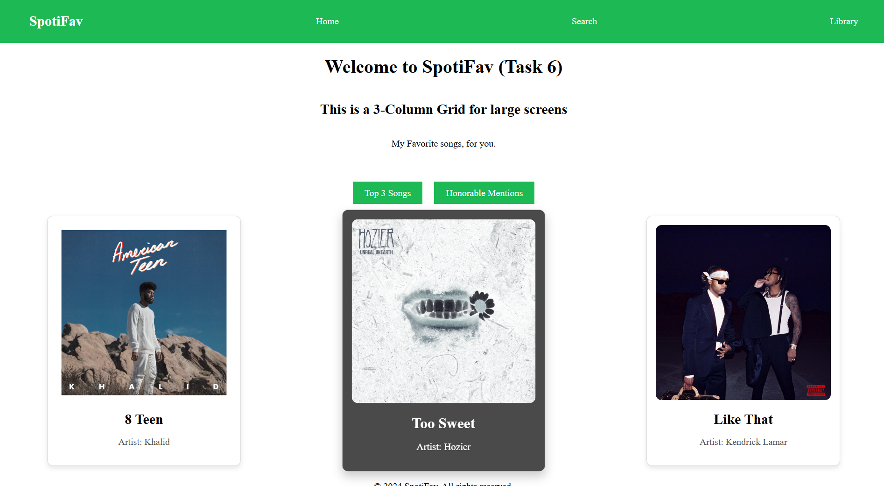
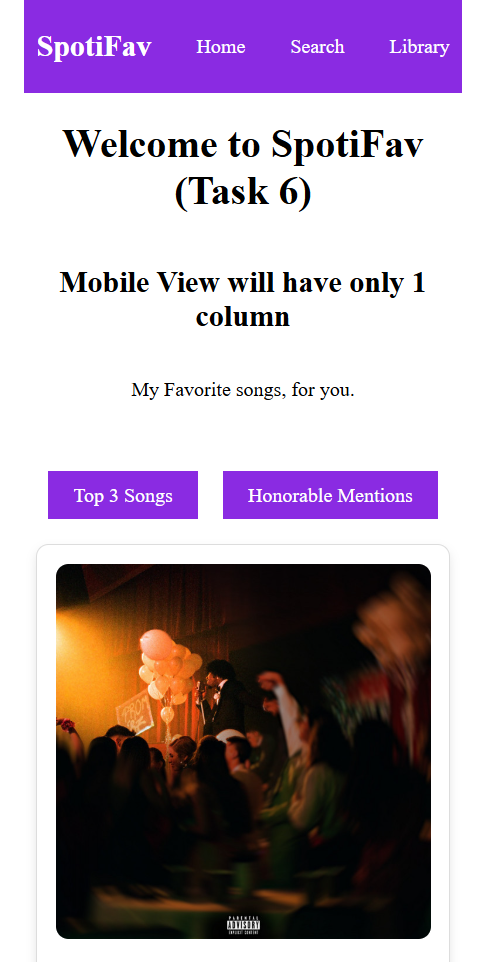

# Task 6

### Objective

- Build a tab interface that shwows different secctions when selected

### 1. Properties Used

- Use _radio wheel_ and _checked_ property to ensure only the selected section was shows to user
- Created two _radio wheel_ inputs and set their _label_ as the title of the sections
- By default, the sections were set to _display:hidden_ and conditionally shown
- When a _radio wheel_ is selected, using _sibling selector_, the content is picked and the property is set as _display:block_. This result in the corresponding section to be visible.

### 2. Output

#### Desktop View:

#### Mobile View:

