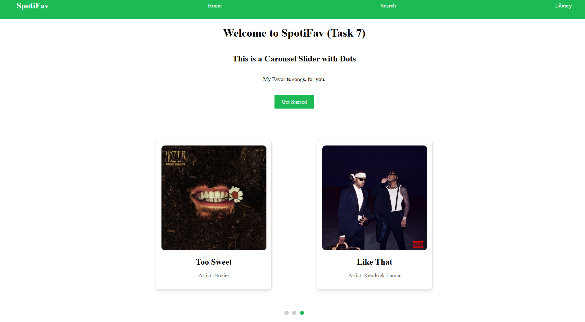
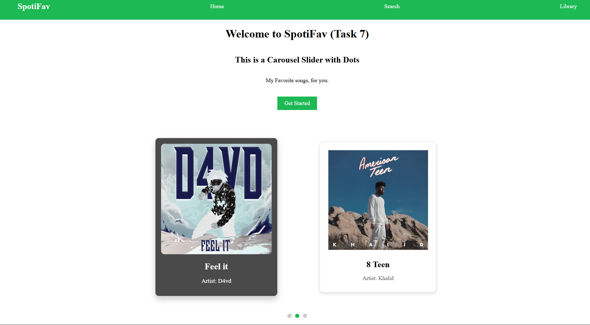

# Task 6

### Objective

- Build a carousel purely out of css

### 1. Properties Used

- Attempt similar to _task 6_
- Use _radio wheel_ and _checked_ property to ensure only the selected section was shows to user
- Created two _radio wheel_ inputs and set their _label_ as the title of the sections
- When a _radio wheel_ is selected, the content of the slide is shows.
- When selection the _next_ or _previous_ _radio wheel_, the _translate_ property is applied and the viewing window is shifted to the next content or slide.
- Horizontal slides on desktop view, vertical slides on mobile view

### 2. Output

#### Desktop View:

