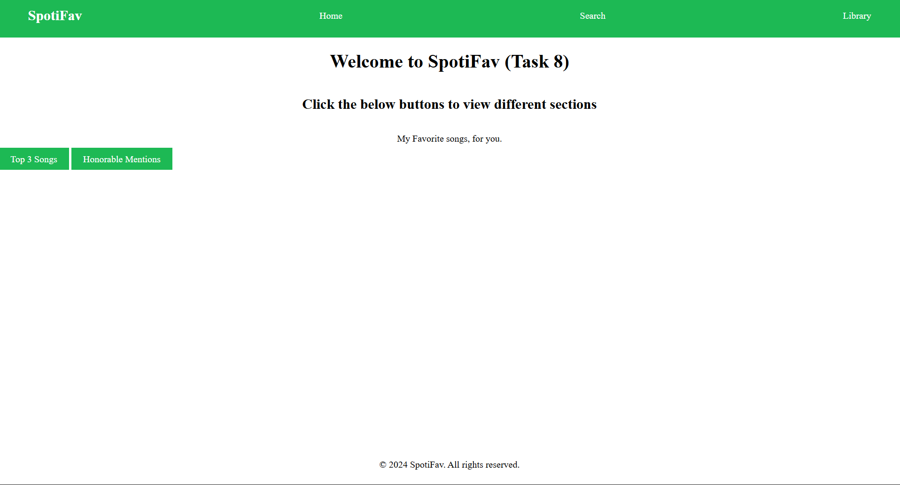
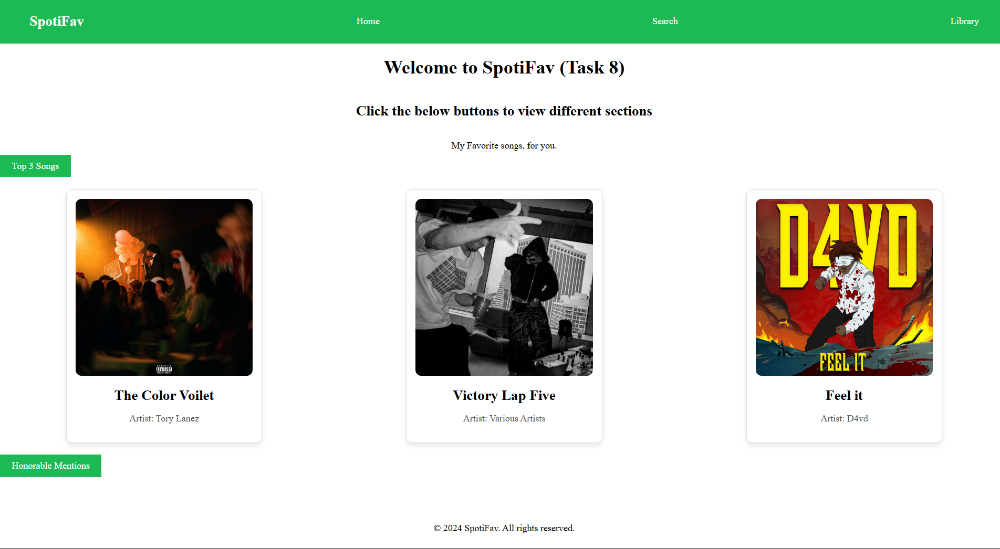
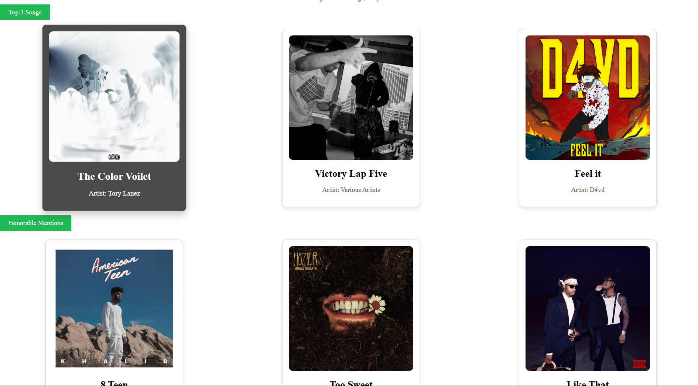

# Task 8

### Objective

- Build a tab interface that shwows different secctions when selected

### 1. Properties Used

- Extremely similar to _task 6_
- instead of _radio wheel_ we used in _task 6_, we use _checkbox_ and _checked_ property to ensure only the selected section is shown to user
- Created two _checkbox_ inputs and set their _label_ as the title of the sections
- By default, the sections were set to _display:hidden_ and conditionally shown
- When a _checkbox input_ is selected, using _sibling selector_, the content is picked and the property is set as _display:block_. This result in the corresponding section to be visible.
- When the _checkbox input_ is unselected, the corresponding section is thus set back to _"hidden"_
- At last, the input _checkbox icon_ is _hidden_ to only show _label_.

### 2. Output

